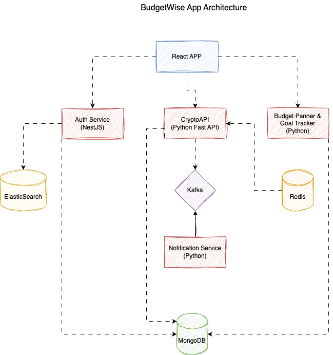

# Financial Planning Application

A service that helps users create financial plans focused on achieving significant goals, such as buying a car, yacht, traveling, or investing.

---

## Features

### 1. Goals and Trackers
- Users can set financial goals (e.g., buying a car for $50,000).
- The app calculates the required monthly savings based on income and expenses.
- Tracks progress toward goals with visual updates.

### 2. Integration with Cryptocurrency Exchanges
- Provides investment recommendations to accelerate goal achievement.
- Analyzes user portfolios and offers personalized suggestions.

### 3. Educational Content
- Offers tips on saving and selecting assets for investments.
- Includes a compound interest calculator for long-term planning.

---

## Example Use Case
- **Goal**: Save $10,000 for a yacht trip.
- **Recommendation**: Save $500/month or invest $3,000 in an ETF with an 8% annual return.
- **Progress Tracker**: Displays metrics like "35% of your goal achieved."

---

## Monetization
- **Free Plan**: 
  - Limited to one goal.
- **Premium Plan ($5/month)**:
  - Includes advanced analytics, investment integration, and detailed reports.

---

## Technical Features

### Goals Management
- **Goal Creation**:
  - Users input a goal, target amount, and deadline.
- **Budgeting**:
  - Users provide monthly income and expenses.
  - Supports budgeting methods like:
    - **50/30/20 Rule**: 50% needs, 30% wants, 20% savings/debt repayment.
    - **Zero-based Budgeting**: Allocates every dollar to a specific category.
  - Categorizes expenses (e.g., housing, food, transport).

### Automatic Recommendations
- Analyzes expenses and suggests optimizations (e.g., "Reduce entertainment by 10%").
- Suggests saving amounts to meet goals faster.
- Generates a detailed financial plan.

### Progress Tracking
- Tracks saved amounts, reduced expenses, and overall progress.
- Displays graphs and trends to monitor financial changes.

---

## Technical Stack
- **Frontend**: React + Recharts (for visualizing progress).
- **Backend API**: Python or JavaScript for budgeting calculations and analytics.

---

## Database Schema

### Table: `goals`
| Column          | Type   | Description                                      |
|------------------|--------|--------------------------------------------------|
| `id`            | UUID   | Unique identifier for the goal.                  |
| `user_id`       | UUID   | Links the goal to a specific user.               |
| `goal_name`     | STRING | Name of the financial goal.                      |
| `target_amount` | INT    | Total amount to be saved.                        |
| `deadline`      | DATE   | Deadline for achieving the goal.                 |

### Table: `budgets`
| Column            | Type    | Description                                      |
|--------------------|---------|--------------------------------------------------|
| `id`              | UUID    | Unique identifier for the budget.                |
| `user_id`         | UUID    | Links the budget to a specific user.             |
| `month`           | STRING  | Month and year of the budget (e.g., Jan 2025).   |
| `income`          | INT     | User's income for the month.                     |
| `expenses`        | INT     | User's expenses for the month.                   |
| `recommendations` | ARRAY   | Suggested budget improvements (e.g., "Reduce expenses by 10%"). |

---

## Monetization
1. **Free Plan**:
   - One financial goal.
   - Basic tracking and budgeting features.
2. **Premium Plan**:
   - Advanced recommendations and analysis.
   - Integration with banks/crypto exchanges.
   - Automatic transaction imports via APIs (e.g., Plaid).

---

## Setup Instructions

1. **Frontend**:
   - Install dependencies: `npm install`
   - Start the app: `npm start`

2. **Backend**:
   - Set up the Python/Node.js API.
   - Configure environment variables (e.g., database credentials, API keys).

3. **Database**:
   - Use the schema definitions to set up the database.
   - Ensure the `goals` and `budgets` tables are properly indexed for performance.

---

This application empowers users to plan their financial goals efficiently while offering tools to save, invest, and track their progress.
